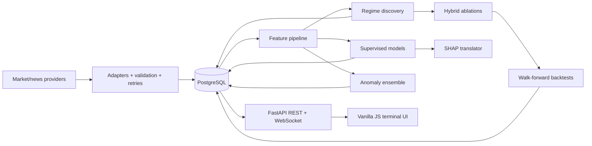

# Architecture

The monorepo is a modular research system, not microservices. Provider adapters normalize external observations. SQLAlchemy models and Alembic migrations make PostgreSQL the durable source. Analytical modules consume DataFrames loaded from that store and persist only observed/calculated outputs. FastAPI exposes those records to the static SPA.

Key boundaries:

- `src/data`: provider abstraction, validation, universe and idempotent ingestion.
- `src/features`: the sole feature definition; callers do not reimplement indicators.
- `src/ml`, `src/regimes`, `src/nlp`, `src/anomaly`, `src/explainability`, `src/backtesting`: research components.
- `backend/app`: configuration, database models, services, REST/WebSocket transport.
- `frontend`: semantic HTML, CSS design system, modular fetch/WebSocket/chart code.
- `scripts`: reproducible operations and experiment entry points.

The WebSocket broadcasts persisted snapshots every 30 seconds. It does not manufacture ticks. A provider-specific ingestion scheduler can update PostgreSQL independently without changing API/UI contracts.

