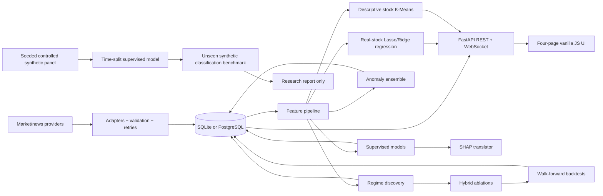

# Architecture

The monorepo is a modular research system. Provider adapters normalize external observations. SQLAlchemy models and Alembic migrations store them in SQLite by default, with PostgreSQL available through configuration. Analytical modules consume DataFrames loaded from that store. FastAPI serves the four-page frontend and API.

```mermaid
flowchart LR
  P[Market/news providers] --> I[Adapters + validation + retries]
  I --> D[(SQLite or PostgreSQL)]
  D --> F[Feature pipeline]
  F --> S[Supervised models]
  F --> R[Regime discovery]
  F --> A[Anomaly ensemble]
  R --> H[Hybrid ablations]
  S --> X[SHAP translator]
  H --> B[Walk-forward backtests]
  D --> API[FastAPI REST + WebSocket]
  S --> D
  R --> D
  A --> D
  B --> D
  API --> UI[Four-page vanilla JS UI]
  C[Seeded controlled synthetic panel] --> CM[Time-split supervised model]
  CM --> E[Unseen synthetic classification benchmark]
  E --> DOC[Research report only]
  F --> LR[Real-stock Lasso/Ridge regression]
  F --> KM[Descriptive stock K-Means]
  LR --> API
  KM --> API
```

Key boundaries:

- `src/data`: provider abstraction, validation, universe and idempotent ingestion.
- `src/features`: the sole feature definition; callers do not reimplement indicators.
- `src/ml`, `src/regimes`, `src/nlp`, `src/anomaly`, `src/explainability`, `src/backtesting`: research components.
- `backend/app`: configuration, database models, services, REST/WebSocket transport.
- `frontend`: semantic HTML, CSS design system, modular fetch/WebSocket/chart code.
- `scripts`: reproducible operations and experiment entry points.

The WebSocket broadcasts persisted snapshots every 30 seconds. It does not manufacture ticks. A provider-specific ingestion scheduler can update the configured database independently without changing API/UI contracts.

The four-page frontend uses actual market history in Overview, Market Explore, Stock Intelligence, and AI Predictions. AI Predictions loads saved real-market direction and Lasso/Ridge regression models. The controlled synthetic benchmark is documented separately and does not feed the live UI. Model fitting is offline; a prediction request loads saved artifacts only.
